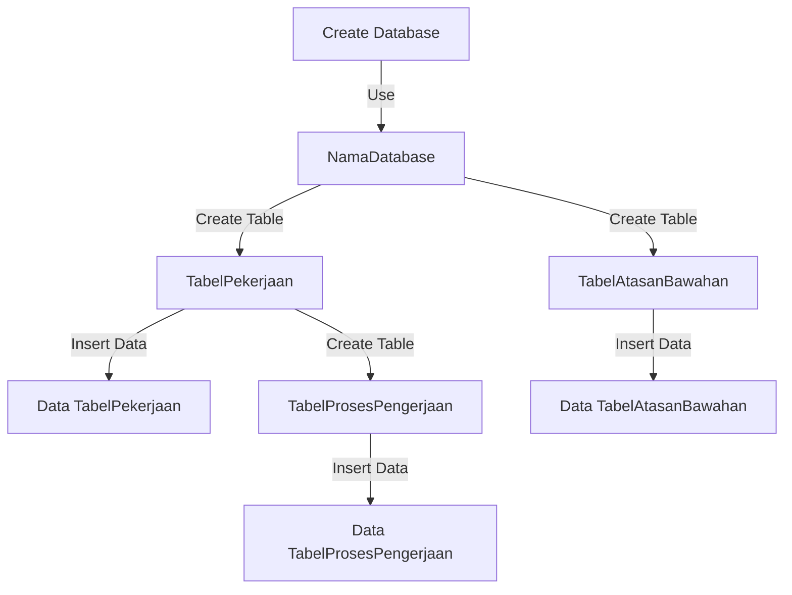
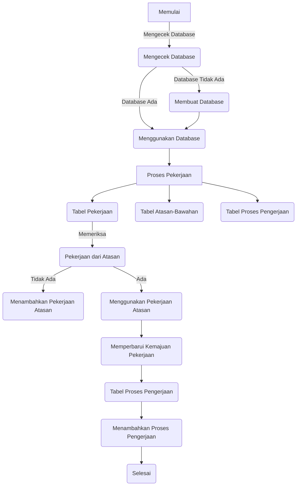
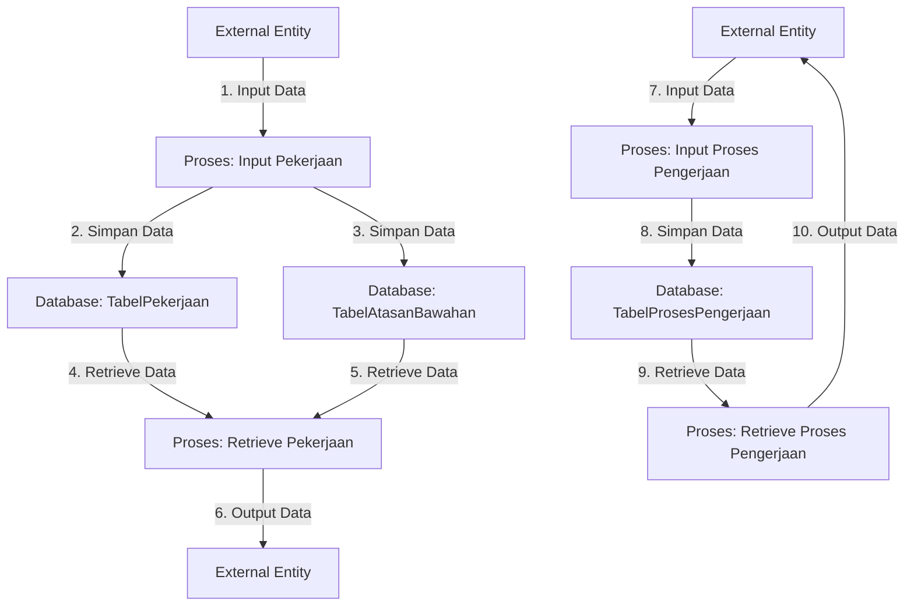

-------------------------------

--------------------

**Diagram Alur Data (DFD)**
External Entity adalah entitas eksternal yang berinteraksi dengan sistem, seperti pengguna atau entitas luar sistem.
Proses merepresentasikan aktivitas atau langkah-langkah yang dilakukan dalam sistem.

Database menunjukkan penyimpanan data.
Panah dengan label angka menunjukkan urutan aliran data atau langkah-langkah dalam sistem.

Penjelasan langkah-langkah dalam DFD ini:

Data pekerjaan diinput ke dalam sistem oleh entitas eksternal.
Data pekerjaan disimpan di dalam tabel pekerjaan dan tabel atasan-bawahan.
Proses mengambil data pekerjaan dari tabel pekerjaan dan tabel atasan-bawahan.

Hasil data pekerjaan dikeluarkan sebagai output untuk entitas eksternal.
Data proses pengerjaan diinput ke dalam sistem oleh entitas eksternal.
Data proses pengerjaan disimpan di dalam tabel proses pengerjaan.
Proses mengambil data proses pengerjaan dari tabel proses pengerjaan.
Hasil data proses pengerjaan dikeluarkan sebagai output untuk entitas eksternal.

