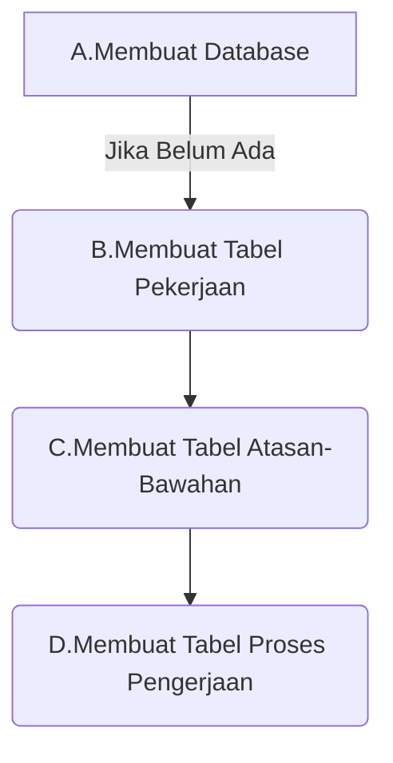
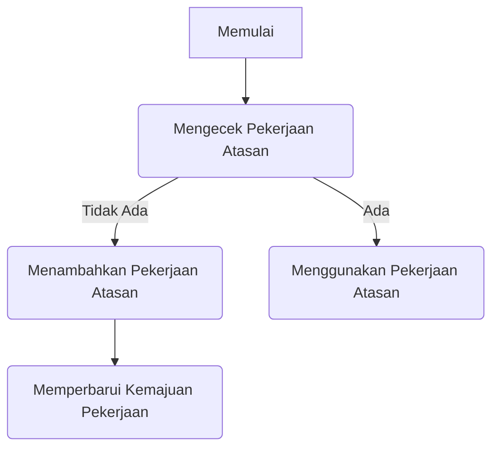
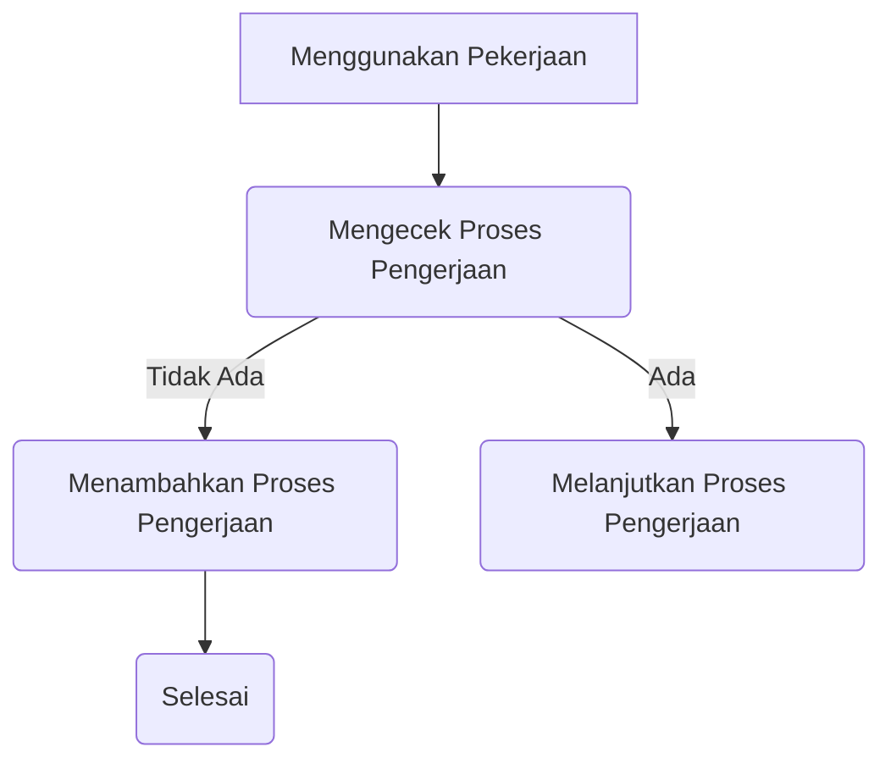

1. Membuat Database dan Tabels



*A.Membuat Database*
```
-- Membuat Database (jika belum ada)
CREATE DATABASE IF NOT EXISTS NamaDatabase;
```
*B.Membuat Tabel Pekerjaan*
```
-- Tabel Pekerjaan
CREATE TABLE IF NOT EXISTS TabelPekerjaan (
    ID_Pekerjaan INT AUTO_INCREMENT PRIMARY KEY,
    Jabatan VARCHAR(50) NOT NULL,
    Gaji DECIMAL(10, 2),
    DapatDiIntervensi BOOLEAN DEFAULT TRUE,
    KemajuanPekerjaan INT DEFAULT 0,
    CONSTRAINT UQ_Jabatan UNIQUE (Jabatan)
);
```
*C.Membuat Tabel Atasan-Bawahan*
```
-- Tabel Atasan-Bawahan (Relasi)
CREATE TABLE IF NOT EXISTS TabelAtasanBawahan (
    ID_Atasan INT,
    ID_Bawahan INT,
    PRIMARY KEY (ID_Atasan, ID_Bawahan),
    FOREIGN KEY (ID_Atasan) REFERENCES TabelPekerjaan (ID_Pekerjaan),
    FOREIGN KEY (ID_Bawahan) REFERENCES TabelPekerjaan (ID_Pekerjaan)
);
```
*D.Membuat Tabel Proses Pengerjaan*
```
-- Tabel ProsesPengerjaan
CREATE TABLE IF NOT EXISTS TabelProsesPengerjaan (
    ID_Proses INT AUTO_INCREMENT PRIMARY KEY,
    ID_Pekerjaan INT,
    KemajuanPengerjaan INT DEFAULT 0,
    TanggalSelesai DATE,
    FOREIGN KEY (ID_Pekerjaan) REFERENCES TabelPekerjaan (ID_Pekerjaan)
);
```
**2. Menambahkan Pekerjaan dari Atasan**




3. Menambahkan Proses Pengerjaan


